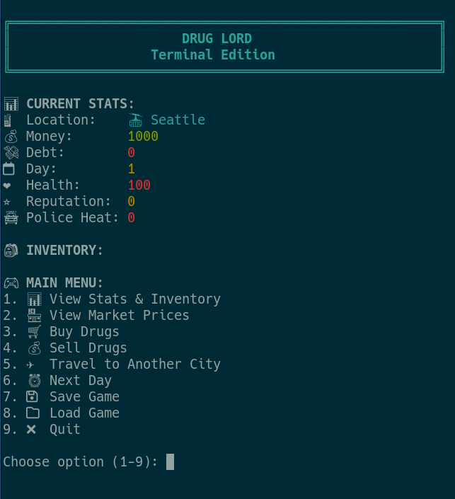

# DrugLord.sh



## Overview
This is an attempt to make a version reminiscent of the original DrugLord.exe
that was written by Phil Erwin (FantasyWare Inc 1991-93).
This version is written as a bash script trying to stick to only GNU coreutils.

## File Structure

```
druglord/
├── druglord.sh              # Main game script
├── README.md                 # This documentation
└── lib/                      # Library directory
    ├── colors.sh             # Color functions and ANSI escape codes
    ├── data.sh               # Game data arrays and initial state
    ├── game.sh               # Core game mechanics and logic
    ├── menus.sh              # All menu functions (buy, sell, travel)
    ├── save.sh               # Save and load game functionality
    └── utils.sh              # Utility functions and display functions
```

## Library Breakdown

### `colors.sh`
- All ANSI color functions (red, green, yellow, blue, etc.)
- Bold and dim text formatting
- Used throughout the game for visual appeal

### `data.sh`
- Game state variables (MONEY, DEBT, DAY, etc.)
- Drug arrays (names, prices, volatility, inventory)
- City system data (names, price multipliers, travel costs)
- Travel cost volatility and base cost arrays
- Banking system variables (savings, loans, interest rates)
- Initial game state setup

### `game.sh`
- Core game mechanics (buy_drug, sell_drug)
- Price fluctuation algorithms (drugs and travel costs)
- Travel cost fluctuation system with volatility
- Police encounters and random events
- Banking system with daily interest processing
- Game over conditions and day progression

### `menus.sh`
- Main menu display
- Buy drugs menu with price indicators
- Sell drugs menu
- Travel menu with city selection and fluctuating costs
- Hospital menu with healing options and dynamic pricing
- Banking menu with savings and loan management

### `save.sh`
- Save game state to file with automatic backup creation
- Load game state from file with integrity validation
- Handles all game variables and arrays (including travel cost data)
- Automatic backup restoration on save failures

### `utils.sh`
- Screen clearing and header display
- Stats and inventory display functions
- City initialization and price calculations
- Enhanced market price display with columnar format and trend indicators

## Usage

Run the game with:
```bash
./druglord.sh
```

### Main Menu Options:
1. 📊 View Stats & Inventory
2. 🏪 View Market Prices
3. 🛒 Buy Drugs
4. 💰 Sell Drugs
5. ✈️ Travel to Another City
6. 🏥 Hospital (Heal)
7. 🏦 Bank (Savings & Loans)
8. ⏰ Next Day
9. 💾 Save Game
10. 📁 Load Game
11. ❌ Quit

## Benefits of Modular Structure

1. **Maintainability**: Each function is in its logical library
2. **Readability**: Easier to find and modify specific functionality
3. **Reusability**: Functions can be easily reused across different parts
4. **Testing**: Individual libraries can be tested separately
5. **Collaboration**: Multiple developers can work on different libraries
6. **Documentation**: Each library has a clear, focused purpose
7. **Standard Convention**: Uses the widely recognized `lib/` directory structure

## Dependencies

- `bash` - Shell interpreter
- `bc` - Basic calculator for floating point math
- Standard GNU coreutils (shuf, etc.)

## Features

- 🏙️ **8 Major Cities** with different price multipliers
- ✈️ **Travel System** with fluctuating costs and price adjustments
- 💹 **Dynamic Price Fluctuation** for both drugs and travel costs
- 🎯 **Volatility-Based Travel Costs** (longer distances = higher volatility)
- 🚔 **Police Encounters** and random events
- 🏥 **Hospital System** with dynamic healing costs and emergency fees
- 🏦 **Banking System** with savings accounts and loans with daily interest
- 💾 **Enhanced Save/Load System** with backup and integrity validation
- 🎨 **Colored Terminal Output** for enhanced visual experience
- ✅ **Comprehensive Input Validation** and error handling

## Travel Cost Fluctuation System

The game now features dynamic travel costs that fluctuate in real-time, similar to drug prices:

### **Volatility Levels by City:**
- **Seattle**: 25 (Very High) - Longest distance, most price swings
- **Los Angeles**: 20 (High) - Longer distance, significant fluctuations  
- **Las Vegas**: 18 (Medium-High) - Moderate distance, notable changes
- **New York, Denver**: 15 (Medium) - Average volatility
- **Miami**: 12 (Low-Medium) - Shorter distance, smaller changes
- **Chicago**: 10 (Low) - Close distance, stable prices
- **Boston**: 8 (Very Low) - Shortest distance, most stable

### **How It Works:**
- Travel costs fluctuate each time you view the travel menu
- Costs are bounded between 50%-200% of their base values
- Market pressure helps costs return toward base values over time
- Longer distance cities have higher volatility and more dramatic price changes
- The system adds strategic depth to travel planning and timing

### **Real-Time Updates:**
- Costs update dynamically when accessing the travel menu
- Visual indicator shows "✈️ Travel costs fluctuate in real-time!"
- All travel cost data is saved and loaded with your game progress

## Hospital System

The game features a comprehensive hospital system for health management:

### **Healing Mechanics:**
- Only accessible when health is below 100
- Three treatment options with different costs and effects
- Dynamic pricing based on current health level
- Emergency fees for critical health conditions

### **Treatment Options:**
1. **💉 Full Treatment** - Restores health to 100
2. **🩹 Partial Treatment** - Restores 25 health points
3. **💊 Basic Treatment** - Restores 10 health points

### **Pricing System:**
- **Base cost**: $50
- **Cost per health point**: $10
- **Emergency fees**:
  - Health < 20: +$200 emergency fee
  - Health < 50: +$100 emergency fee

### **Examples:**
- Health 80: Full treatment = $250
- Health 30: Full treatment = $850 (includes emergency fee)
- Health 10: Full treatment = $1,150 (includes emergency fee)

## Banking System

The game features a comprehensive banking system for financial management:

### **Banking Services:**
- **💰 Savings Account**: Earn 5% daily interest on deposits
- **💳 Loan System**: Borrow money at 15% daily interest
- **📊 Financial Tracking**: Monitor all banking activities
- **⏰ Daily Processing**: Automatic interest calculation each day

### **Savings Account:**
- **Interest Rate**: 5% per day (compound interest)
- **Deposit/Withdraw**: Full control over savings
- **Example**: $1000 savings = $50 interest per day

### **Loan System:**
- **Interest Rate**: 15% per day (high risk)
- **Flexible Terms**: Choose loan amount and repayment days
- **Overdue Penalty**: Converts to general debt if not repaid
- **Example**: $1000 loan = $150 interest per day

### **Banking Menu Options:**
1. **💰 Deposit Money** - Add cash to savings account
2. **💸 Withdraw Money** - Remove money from savings
3. **💳 Take Loan** - Borrow money with interest
4. **💵 Pay Loan** - Make loan payments
5. **📊 View Banking Details** - See all financial information
6. **🚪 Leave Bank** - Exit banking menu

### **Daily Banking Processing:**
- **Savings Interest**: Automatically added each day
- **Loan Interest**: Automatically compounded each day
- **Overdue Loans**: Convert to general debt if not repaid
- **Visual Feedback**: Shows interest earned/owed each day

### **Strategic Considerations:**
- **Risk vs Reward**: High loan interest vs steady savings growth
- **Cash Flow Management**: Balance between cash, savings, and loans
- **Timing**: Critical for loan repayment to avoid penalties
- **Compound Growth**: Savings grow exponentially over time

## Recent Updates & Bug Fixes

### **v2.1 - Banking System & Enhanced Features**

#### **New Features:**
- 🏦 **Banking System**: Complete financial management with savings and loans
- 💰 **Savings Account**: 5% daily interest on deposits
- 💳 **Loan System**: 15% daily interest borrowing with flexible terms
- 📊 **Financial Tracking**: Comprehensive banking information display
- ⏰ **Daily Processing**: Automatic interest calculation and loan management

#### **Banking Features:**
- **Savings Interest**: 5% daily compound interest
- **Loan Management**: High-risk 15% daily interest loans
- **Overdue Protection**: Automatic conversion to general debt
- **Financial Planning**: Balance cash flow and investment strategies

### **v2.0 - Hospital System & Bug Fixes**

#### **New Features:**
- 🏥 **Hospital System**: Complete healing system with dynamic pricing
- 💰 **Emergency Fees**: Higher costs for critical health conditions
- 🔄 **Multiple Treatment Options**: Full, partial, and basic treatments

#### **Bug Fixes:**
- ✅ **Save File Bug**: Fixed critical save file naming inconsistency
- ✅ **Input Validation**: Enhanced validation for all menu inputs
- ✅ **Error Handling**: Improved error messages and user feedback
- ✅ **Save System**: Added automatic backup creation and integrity validation
- ✅ **File Safety**: Backup restoration on save failures

#### **Improvements:**
- 🎯 **Better Error Messages**: More descriptive and consistent error feedback
- 🔒 **Input Safety**: Comprehensive validation prevents crashes
- 💾 **Save Reliability**: Backup system prevents data loss
- 🎨 **User Experience**: Enhanced visual feedback and menu organization

## Planned Features / Updates
- Multiple save files
- Guns for fights
- Pockets / Bags for holding more (planned as a random event)
- ~~Bank system for loans and interest~~ ✅ **COMPLETED**
- .....And more
