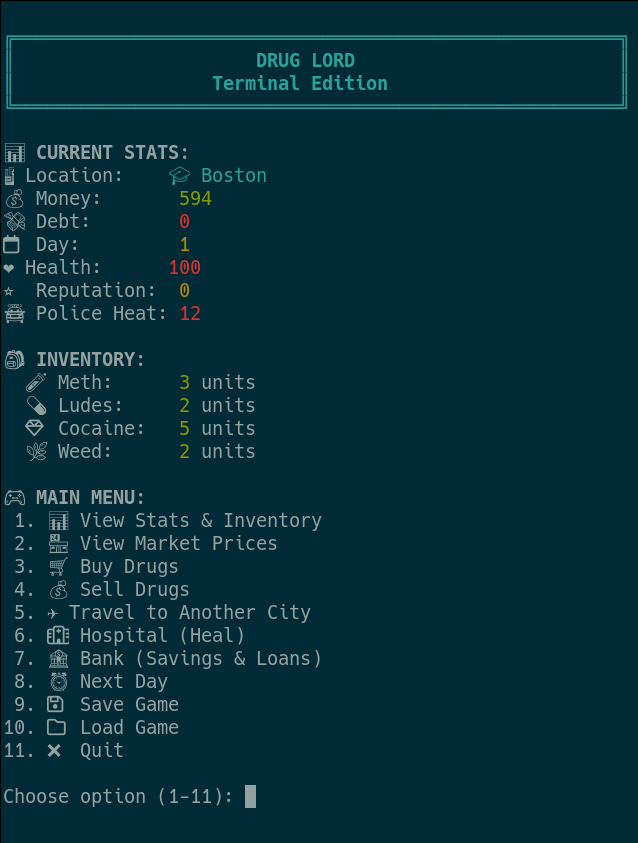

# DrugLord.sh


[](http://unlicense.org/)




## Overview

This is an attempt to make a version reminiscent of the original DrugLord.exe
that was written by Phil Erwin (FantasyWare Inc 1991-93).
This version is written as a bash script trying to stick to only GNU coreutils.

## Features

- 🏙️ **8 Major Cities** with different price multipliers
- 💊 **6 Drug Types** with varying prices and volatility (Ludes, Weed, Cocaine, Heroin, Meth, Ecstasy)
- ✈️ **Travel System** with fluctuating costs and price adjustments
- 💹 **Dynamic Price Fluctuation** for both drugs and travel costs
- 🎯 **Volatility-Based Travel Costs** (longer distances = higher volatility)
- 🚔 **Police Encounters** and random events
- 🏥 **Hospital System** with dynamic healing costs and emergency fees
- 🏦 **Banking System** with savings accounts and loans with daily interest
- 🎲 **Random Events System** with 10 different events including warehouse incidents, market floods, personal drama, and reputation-based encounters
- 💾 **Enhanced Save/Load System** with backup and integrity validation
- 🎨 **Colored Terminal Output** for enhanced visual experience
- ✅ **Comprehensive Input Validation** and error handling

## Usage

Run the game with:
```bash
./druglord.sh
```

### Main Menu Options:
1. 📊 View Stats & Inventory
2. 🏪 View Market Prices
3. 🛒 [B]uy Drugs (or press 'b')
4. 💰 [S]ell Drugs (or press 's')
5. ✈️ [T]ravel to Another City (or press 't')
6. 🏥 [H]ospital (Heal) (or press 'h')
7. 🏦 Bank (Savings & Loans)
8. ⏰ Next Day
9. 💾 Save Game
10. 📁 Load Game
11. ❌ Quit

**Quick Navigation**: Use [bsth] for Buy, Sell, Travel, Hospital

## Drug Types & Pricing

The game features 6 different drug types with varying prices, volatility, and market characteristics:

### **Available Drugs:**
1. **💊 Ludes** - $5 base price (cheapest, very stable)
2. **🌿 Weed** - $10 base price (low volatility)
3. **💊 Ecstasy** - $25 base price (medium-low volatility)
4. **🧪 Meth** - $30 base price (medium volatility)
5. **💎 Cocaine** - $50 base price (high volatility)
6. **💉 Heroin** - $80 base price (very high volatility)

### **Price Characteristics:**
- **Ludes**: Cheapest drug in all cities ($4-$6 range)
- **Volatility**: Ranges from 3 (ludes) to 20 (heroin)
- **City Multipliers**: Prices adjust based on location
- **Market Fluctuation**: All drugs experience price changes over time

### **Strategic Considerations:**
- **Low-Risk Trading**: Ludes and weed for steady, safe profits
- **High-Risk Trading**: Heroin and cocaine for potential big gains
- **Market Timing**: Volatile drugs require careful timing
- **Inventory Management**: Balance between safe and risky investments

## Travel Cost Fluctuation System

The game now features dynamic travel costs that fluctuate in real-time, similar to drug prices:

### **Volatility Levels by City:**
- **Seattle**: 25 (Very High) - Longest distance, most price swings
- **Los Angeles**: 20 (High) - Longer distance, significant fluctuations  
- **Las Vegas**: 18 (Medium-High) - Moderate distance, notable changes
- **New York, Denver**: 15 (Medium) - Average volatility
- **Miami**: 12 (Low-Medium) - Shorter distance, smaller changes
- **Chicago**: 10 (Low) - Close distance, stable prices
- **Boston**: 8 (Very Low) - Shortest distance, most stable

### **How It Works:**
- Travel costs fluctuate each time you view the travel menu
- Costs are bounded between 50%-200% of their base values
- Market pressure helps costs return toward base values over time
- Longer distance cities have higher volatility and more dramatic price changes
- The system adds strategic depth to travel planning and timing

### **Real-Time Updates:**
- Costs update dynamically when accessing the travel menu
- Visual indicator shows "✈️ Travel costs fluctuate in real-time!"
- All travel cost data is saved and loaded with your game progress

## Random Events System

The game features a comprehensive random events system that adds unpredictability and excitement to gameplay:

### **Event Triggers:**
- Events occur when you advance to the next day (option 8)
- Each event has a ~5% chance of occurring (1 out of 20 possible outcomes)
- Events are city-specific and can dramatically affect local drug prices
- Some events have special conditions (e.g., snitch event requires reputation > 11)

### **Available Events:**

#### **Financial Events:**
1. **💰 Found Money** - Discover $100-$600 on the street
2. **💸 Got Robbed** - Lose $50-$250 to street criminals
3. **💳 Loan Shark Demands** - Forced $200 debt increase
4. **💸 Debt Payment** - Automatic $50-$150 debt reduction

#### **Health Events:**
5. **❤️ Health Boost** - Gain 10 health points (capped at 100)

#### **Market Disruption Events:**
6. **🔥 Warehouse Fire** - Local warehouse burns down, causing supply shortage
7. **🚔 Warehouse Raid** - Police raid local warehouse, disrupting supply
8. **🚢 Market Flooded** - Ship arrives with massive drug supply, causing price crash

#### **Personal Events:**
9. **💔 Girlfriend Weed Incident** - Your girlfriend destroys all your weed inventory

#### **Reputation-Based Events:**
10. **🚨 Snitch Event** - A snitch demands payment or threatens to go to police (requires reputation > 11)

### **Market Disruption Effects:**
- **Price Increases** (Fire/Raid): 1.1x to 3.3x original price
- **Price Decreases** (Flooded): 0.25x to 0.75x original price
- **Affected Drugs**: 1-4 random drugs per event
- **Duration**: Permanent until next price fluctuation
- **City-Specific**: Only affects drugs in your current city

### **Snitch Event Details:**
- **Trigger Condition**: Only occurs when reputation > 11
- **Demand**: 10-25% of your current money
- **Intimidation Cost**: 10 + (0.2-0.4 × reputation) points
- **Choices**:
  - **Pay Off**: Lose money + increase police heat
  - **Intimidate**: Lose reputation + no police heat increase
- **Consequences**: Failure to handle results in automatic police heat increase

### **Strategic Impact:**
- **Risk Management**: Events can create both opportunities and threats
- **Market Timing**: Plan your trades around potential disruptions
- **City Selection**: Some cities may be more prone to certain events
- **Financial Planning**: Unexpected costs and windfalls require adaptation
- **Reputation Management**: High reputation brings both benefits and risks

## Hospital System

The game features a comprehensive hospital system for health management:

### **Healing Mechanics:**
- Only accessible when health is below 100
- Three treatment options with different costs and effects
- Dynamic pricing based on current health level
- Emergency fees for critical health conditions

### **Treatment Options:**
1. **💉 Full Treatment** - Restores health to 100
2. **🩹 Partial Treatment** - Restores 25 health points
3. **💊 Basic Treatment** - Restores 10 health points

### **Pricing System:**
- **Base cost**: $50
- **Cost per health point**: $10
- **Emergency fees**:
  - Health < 20: +$200 emergency fee
  - Health < 50: +$100 emergency fee

### **Examples:**
- Health 80: Full treatment = $250
- Health 30: Full treatment = $850 (includes emergency fee)
- Health 10: Full treatment = $1,150 (includes emergency fee)

## Banking System

The game features a comprehensive banking system for financial management:

### **Banking Services:**
- **💰 Savings Account**: Earn 5% daily interest on deposits
- **💳 Loan System**: Borrow money at 15% daily interest
- **📊 Financial Tracking**: Monitor all banking activities
- **⏰ Daily Processing**: Automatic interest calculation each day

### **Savings Account:**
- **Interest Rate**: 5% per day (compound interest)
- **Deposit/Withdraw**: Full control over savings
- **Example**: $1000 savings = $50 interest per day

### **Loan System:**
- **Interest Rate**: 15% per day (high risk)
- **Flexible Terms**: Choose loan amount and repayment days
- **Overdue Penalty**: Converts to general debt if not repaid
- **Example**: $1000 loan = $150 interest per day

### **Banking Menu Options:**
1. **💰 Deposit Money** - Add cash to savings account
2. **💸 Withdraw Money** - Remove money from savings
3. **💳 Take Loan** - Borrow money with interest
4. **💵 Pay Loan** - Make loan payments
5. **📊 View Banking Details** - See all financial information
6. **🚪 Leave Bank** - Exit banking menu

### **Daily Banking Processing:**
- **Savings Interest**: Automatically added each day
- **Loan Interest**: Automatically compounded each day
- **Overdue Loans**: Convert to general debt if not repaid
- **Visual Feedback**: Shows interest earned/owed each day

### **Strategic Considerations:**
- **Risk vs Reward**: High loan interest vs steady savings growth
- **Cash Flow Management**: Balance between cash, savings, and loans
- **Timing**: Critical for loan repayment to avoid penalties
- **Compound Growth**: Savings grow exponentially over time

## File Structure

```
druglord/
├── druglord.sh              # Main game script
├── README.md                 # This documentation
├── CHANGELOG.md              # Version history and updates
└── lib/                      # Library directory
    ├── colors.sh             # Color functions and ANSI escape codes
    ├── data.sh               # Game data arrays and initial state
    ├── game.sh               # Core game mechanics and logic
    ├── menus.sh              # All menu functions (buy, sell, travel)
    ├── random_events.sh      # Random events system and event functions
    ├── save.sh               # Save and load game functionality
    └── utils.sh              # Utility functions and display functions
```

## Library Breakdown

### `colors.sh`
- All ANSI color functions (red, green, yellow, blue, etc.)
- Bold and dim text formatting
- Used throughout the game for visual appeal

### `data.sh`
- Game state variables (MONEY, DEBT, DAY, etc.)
- Drug arrays (names, prices, volatility, inventory) - 6 drug types including ludes
- City system data (names, price multipliers, travel costs)
- Travel cost volatility and base cost arrays
- Banking system variables (savings, loans, interest rates)
- Initial game state setup

### `game.sh`
- Core game mechanics (buy_drug, sell_drug)
- Price fluctuation algorithms (drugs and travel costs)
- Travel cost fluctuation system with volatility
- Police encounters and random events
- Banking system with daily interest processing
- Game over conditions and day progression

### `menus.sh`
- Main menu display
- Buy drugs menu with price indicators and max purchase calculations
- Sell drugs menu
- Travel menu with city selection and fluctuating costs
- Hospital menu with healing options and dynamic pricing
- Banking menu with savings and loan management

### `save.sh`
- Save game state to file with automatic backup creation
- Load game state from file with integrity validation
- Handles all game variables and arrays (including travel cost data)
- Automatic backup restoration on save failures

### `random_events.sh`
- Random events system that triggers when advancing to the next day
- 10 different random events including warehouse fires, police raids, market floods, and personal drama
- Price manipulation events that affect drug costs in current city (both increases and decreases)
- Financial events (found money, robbery, debt changes)
- Health and reputation events
- Personal events that affect inventory and relationships
- Conditional events based on player stats (reputation, inventory)

### `utils.sh`
- Screen clearing and header display
- Stats and inventory display functions
- City initialization and price calculations
- Enhanced market price display with columnar format and trend indicators

## Dependencies

- `bash` - Shell interpreter
- `bc` - Basic calculator for floating point math
- Standard GNU coreutils (shuf, etc.)

## Version History

For detailed information about recent updates, bug fixes, and new features, see [CHANGELOG.md](CHANGELOG.md).

## Planned Features / Updates
- Multiple save files
- Guns for fights
- Pockets / Bags for holding more (planned as a random event)
- ~~Bank system for loans and interest~~ ✅ **COMPLETED**
- .....And more
